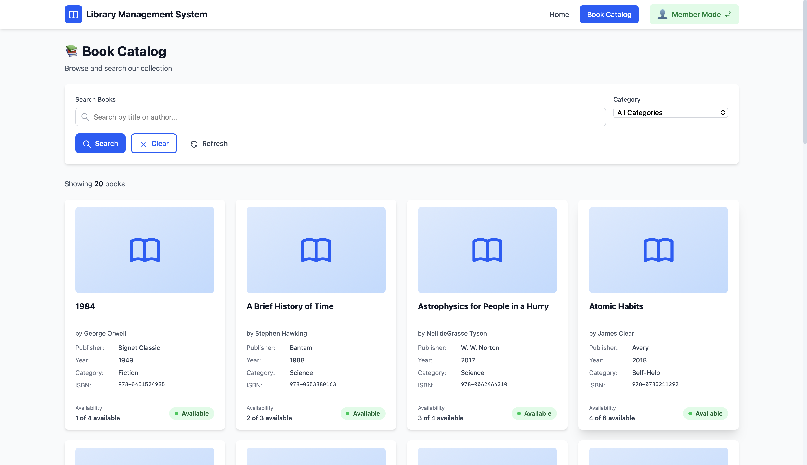
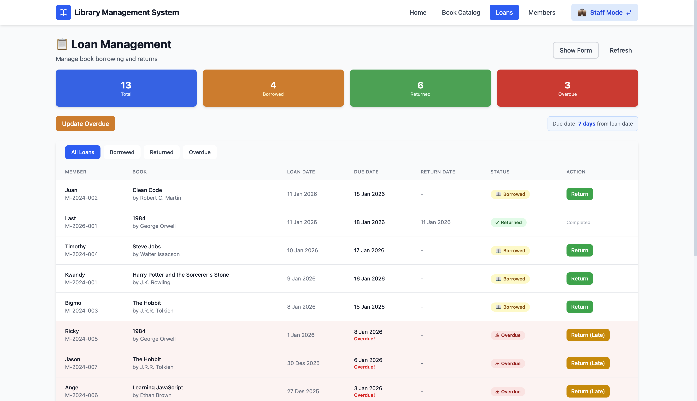
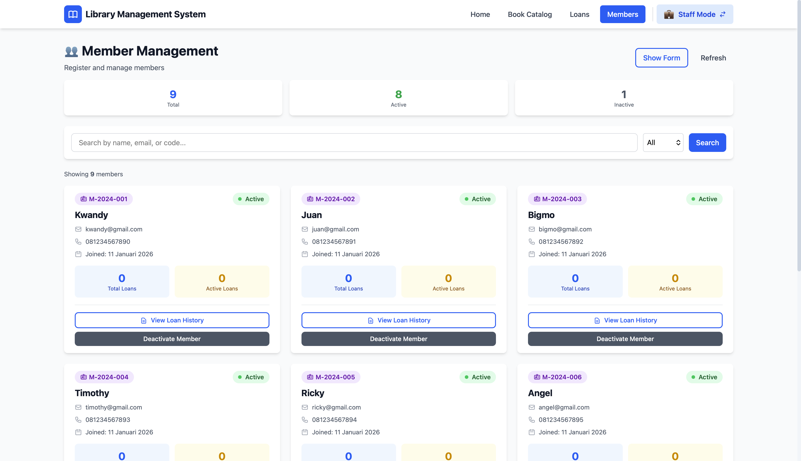
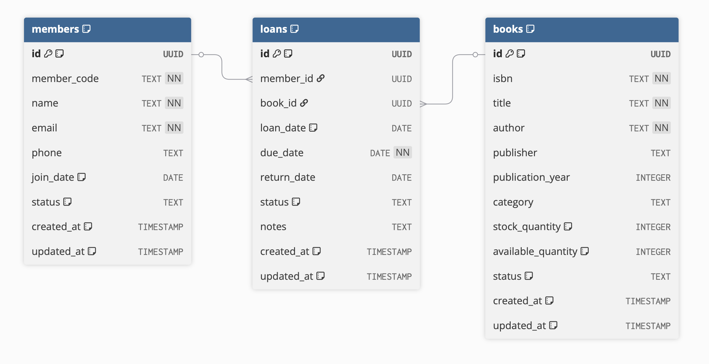

# 📚 Library Management System

> **LSP Certification Project - PEMROGRAM (PROGRAMMER)**  
> Certificate: IMT.01.15/SSK/LSP/X/2021 | January 2026

Web-based Library Management System to manage book loans, catalog and members.

Author : Kwandy Chandra

---

## 📸 Screenshots

### 🏠 Home Dashboard


### 📚 Book Catalog


### 📄 Loans Management


### 👥 Members Management


---

## ✨ Features

### Member Mode
- 📖 Browse book catalog
- 🔍 Search by title/author
- 🏷️ Filter by category
- ✅ Check availability

### Staff Mode
- ➕ Create loans (borrow books)
- ↩️ Return books
- 👥 Register members
- 📊 View statistics
- ⚠️ Track overdue books
- 📅 Auto due date (7 days)

### System
- 🔄 Member/Staff mode toggle
- 📱 Responsive design
- ⚡ Real-time updates
- 💾 Persistent state (localStorage)

---

## 🛠️ Tech Stack

**Frontend:**
- React 19.2.0
- Vite 7.2.4
- Tailwind CSS 4
- React Router 7.12.0

**Backend/Database:**
- Supabase (PostgreSQL + Auth)
- @supabase/supabase-js 2.90.1

---

## 🚀 Quick Start

### Prerequisites
- Node.js 18+
- npm 9+
- Supabase account

### Installation

```bash
# 1. Clone repository
git clone https://github.com/OoMyGit/library-management-system.git
cd library-management-system

# 2. Install dependencies
npm install

# 3. Setup environment
cp .env.example .env.local
# Edit .env.local with your Supabase credentials

# 4. Run development server
npm run dev
```

### Environment Variables

Create `.env.local`:
```env
VITE_SUPABASE_URL=your_supabase_url
VITE_SUPABASE_KEY=your_supabase_anon_key
```

---

## 📁 Project Structure

```
src/
├── components/          # React components
│   ├── common/         # Button, Card, Input, Alert, Loading
│   ├── catalog/        # BookCard, BookList, SearchBar
│   ├── loans/          # LoanForm, LoanTable
│   ├── members/        # MemberForm, MemberCard
│   └── layout/         # Navbar, Footer
├── pages/              # Page components
│   ├── Home.jsx
│   ├── Catalog.jsx
│   ├── StaffLoans.jsx
│   └── StaffMembers.jsx
├── services/           # Business logic (OOP)
│   ├── BookService.js
│   ├── LoanService.js
│   └── MemberService.js
├── hooks/              # Custom React hooks
│   ├── useBooks.js
│   ├── useLoans.js
│   └── useMembers.js
├── constants/          # App constants
├── supabase-client.js  # Supabase config
└── App.jsx             # Main app component
```

---

## 🗄️ Database Schema

### Tables

**books**
```sql
- id (UUID, PK)
- isbn (VARCHAR, UNIQUE)
- title (VARCHAR)
- author (VARCHAR)
- publisher (VARCHAR)
- publication_year (INT)
- category (VARCHAR)
- stock_quantity (INT)
- available_quantity (INT)
- status (VARCHAR)
```

**members**
```sql
- id (UUID, PK)
- member_code (VARCHAR, UNIQUE) -- Format: M-YYYY-XXX
- name (VARCHAR)
- email (VARCHAR, UNIQUE)
- phone (VARCHAR)
- join_date (DATE)
- status (VARCHAR) -- active/inactive
```

**loans**
```sql
- id (UUID, PK)
- member_id (UUID, FK → members.id)
- book_id (UUID, FK → books.id)
- loan_date (DATE)
- due_date (DATE) -- auto: loan_date + 7 days
- return_date (DATE, nullable)
- status (VARCHAR) -- borrowed/returned/overdue
- notes (TEXT)
```

**Relationships:**
- loans.member_id → members.id (Many-to-One)
- loans.book_id → books.id (Many-to-One)

#### ERD Diagram


---

## 💻 OOP Implementation

### 1. Inheritance

```javascript
// services/BaseService.js - Parent Class
class BaseService {
  constructor(tableName) {
    this.tableName = tableName
  }

  async getAll() {
    const { data } = await supabase.from(this.tableName).select('*')
    return data || []
  }

  async getById(id) {
    const { data } = await supabase
      .from(this.tableName)
      .select('*')
      .eq('id', id)
      .single()
    return data
  }
}

// services/BookService.js - Child Class
class BookService extends BaseService {
  constructor() {
    super('books') // Call constructor parent
  }
  
  // ✓  getAll() from parent
  // ✓  getById() from parent
  
  async searchBooks(term) {
    // Method khusus BookService
    const { data } = await supabase
      .from(this.tableName)
      .select('*')
      .ilike('title', `%${term}%`)
    return data
  }
}

// Usage
const bookService = new BookService()
await bookService.getAll()         // Method from parent!
await bookService.searchBooks('Harry') // Method from child!
```

**Benefit:** Code reuse, tidak perlu tulis `getAll()` di setiap service

**Child classes yang mewarisi BaseService:**
- `BookService` - untuk books table
- `MemberService` - untuk members table

---

### 2. Polymorphism

```javascript
// components/common/Button.jsx
function Button({ variant = 'primary', children, onClick }) {
  const styles = {
    primary: 'bg-blue-600 text-white',
    danger: 'bg-red-600 text-white',
    outline: 'border-2 border-blue-600'
  }
  
  return (
    <button className={styles[variant]} onClick={onClick}>
      {children}
    </button>
  )
}

// Usage - One component, many variant
<Button variant="primary">Save</Button>
<Button variant="danger">Delete</Button>
<Button variant="outline">Cancel</Button>
```

**Benefit:** One interface, many forms

---

### 3. Overloading (Optional Parameters)

```javascript
// services/LoanService.js
class LoanService {
  // Can be called with 2, 3, or 4 parameter
  async createLoan(memberId, bookId, notes = '', options = {}) {
    const { sendEmail = false } = options
    
    const loan = await supabase.from('loans').insert({
      member_id: memberId,
      book_id: bookId,
      notes: notes  // Optional parameter
    })
    
    if (sendEmail) await this.sendNotification(loan)
    return loan
  }
}

// Usage - Different way to call!
await loanService.createLoan(m1, b1)                    // 2 params
await loanService.createLoan(m1, b1, 'Urgent')          // 3 params  
await loanService.createLoan(m1, b1, '', { sendEmail: true })  // 4 params
```

**Benefit:** Flexible API, satu method banyak cara pakai

---

## 🧪 Testing

**Total Test Cases:** 15  
**Passed:** 15 ✅  
**Success Rate:** 100%

### Test Categories
1. User Interface (3 tests)
2. Book Catalog (3 tests)
3. Loan Management (5 tests)
4. Member Management (3 tests)
5. Business Logic (1 test)

### Sample Test Case

**TC-05: Create Loan (Staff Mode)**
- **Precondition:** Staff mode, member & book available
- **Steps:** Select member → Select book → Submit
- **Expected:** Success message, loan created, due date = today + 7
- **Result:** ✅ PASS

See [TESTING.md](docs/TESTING.md) for complete test documentation.


---

## 🎯 Requirements ✅

| Requirement | Status | Location |
|-------------|--------|----------|
| Book catalog | ✅ | src/pages/Catalog.jsx |
| Create loan (staff) | ✅ | src/components/loans/LoanForm.jsx |
| Return book | ✅ | src/components/loans/LoanTable.jsx |
| Auto due date (7 days) | ✅ | src/services/LoanService.js |
| Member registration | ✅ | src/components/members/MemberForm.jsx |
| OOP concepts | ✅ | Services + Hooks pattern |
| Database design | ✅ | 3 tables with relationships |
| Testing | ✅ | 15 test cases (100% pass) |

---

## 📝 Scripts

```bash
npm run dev      # Start development server (http://localhost:5173)
npm run build    # Build for production
npm run preview  # Preview production build
npm run lint     # Run ESLint
```

---

## 🔧 Configuration

### Supabase Setup

1. Create project at [supabase.com](https://supabase.com)
2. Go to SQL Editor and run:
   ```sql
   -- Create tables (see database-schema.sql)
   -- Insert sample data
   ```
3. Get credentials: Settings → API
4. Add to `.env.local`

### Tailwind CSS

Configured with Vite plugin. No config file needed.

---

# 👨‍💻 Author

## **Kwandy Chandra**  
LSP Certification - PEMROGRAM (PROGRAMMER)
