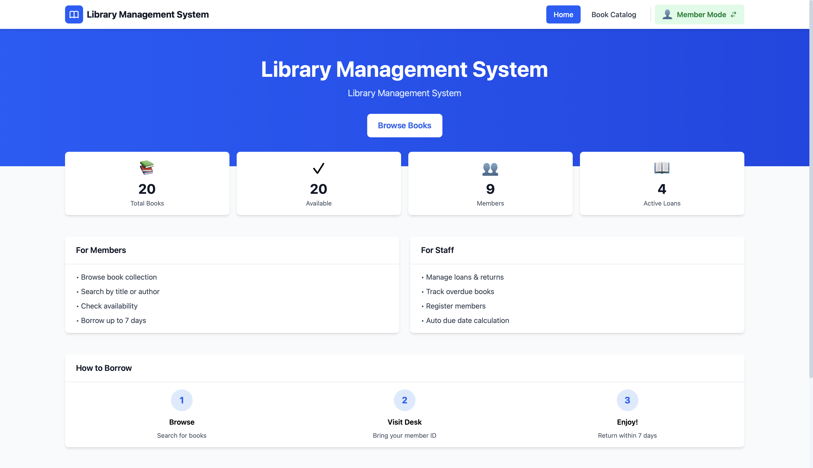
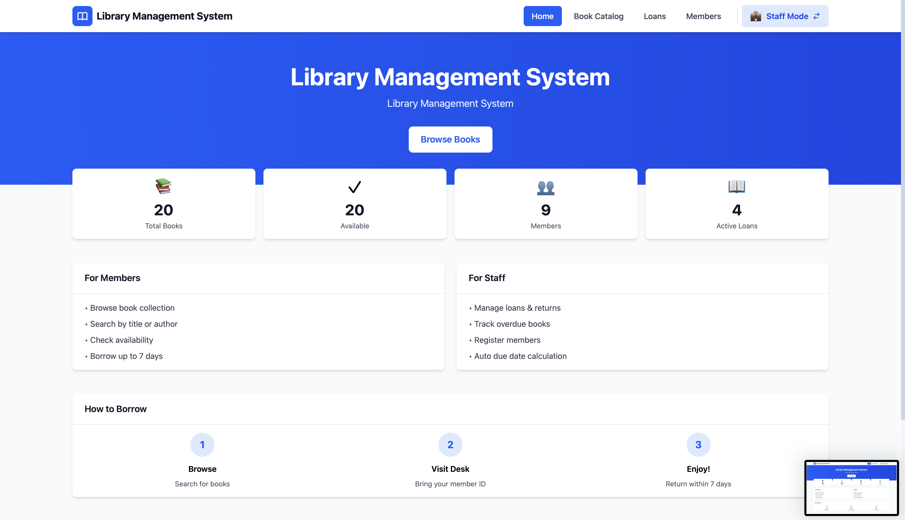
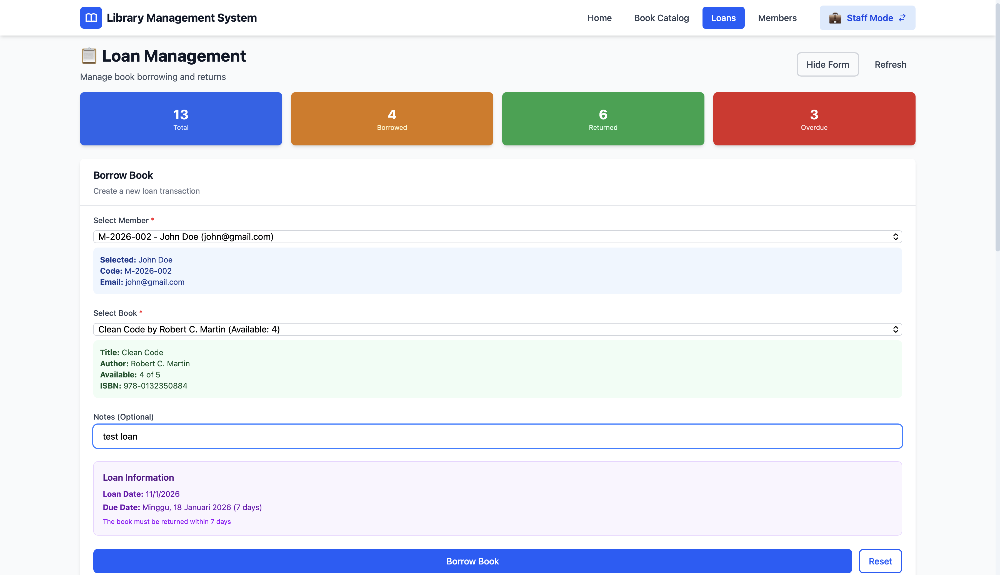
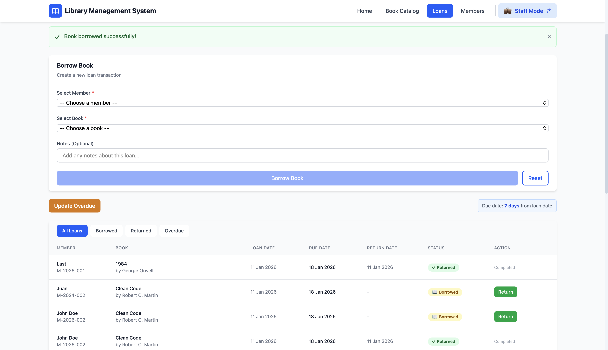
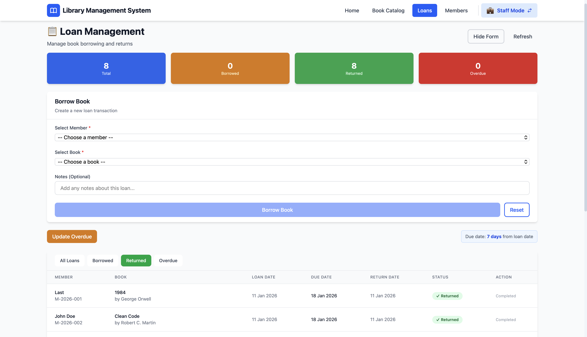
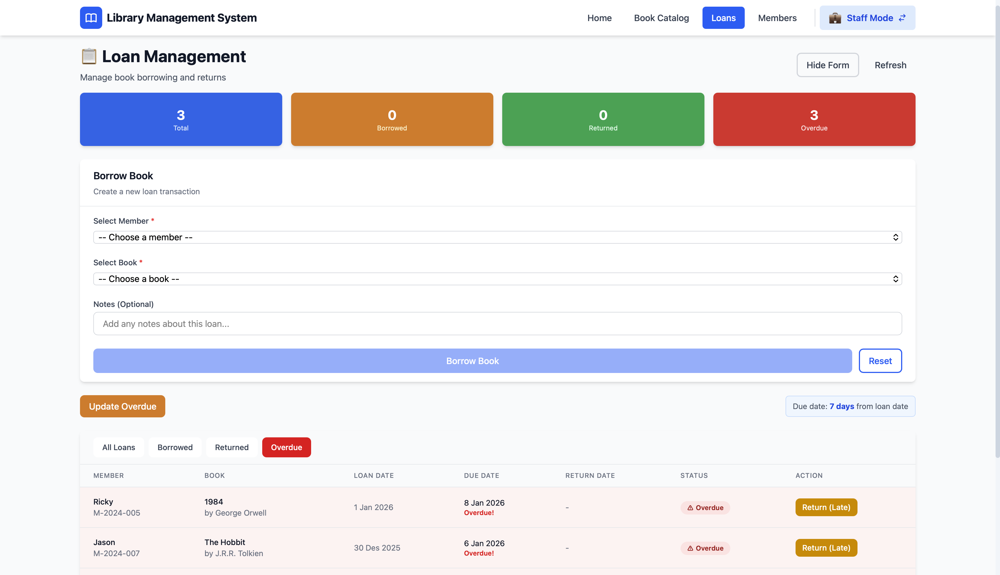
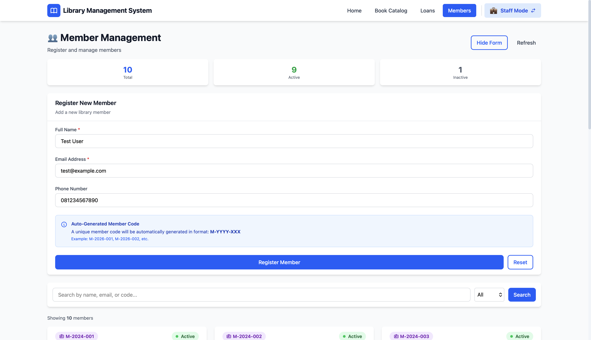
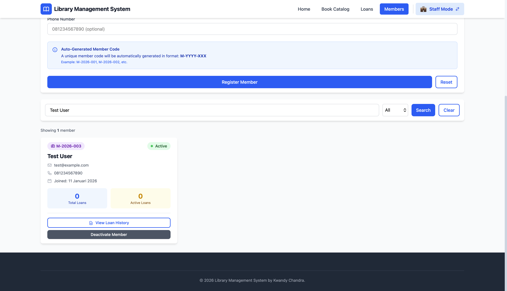
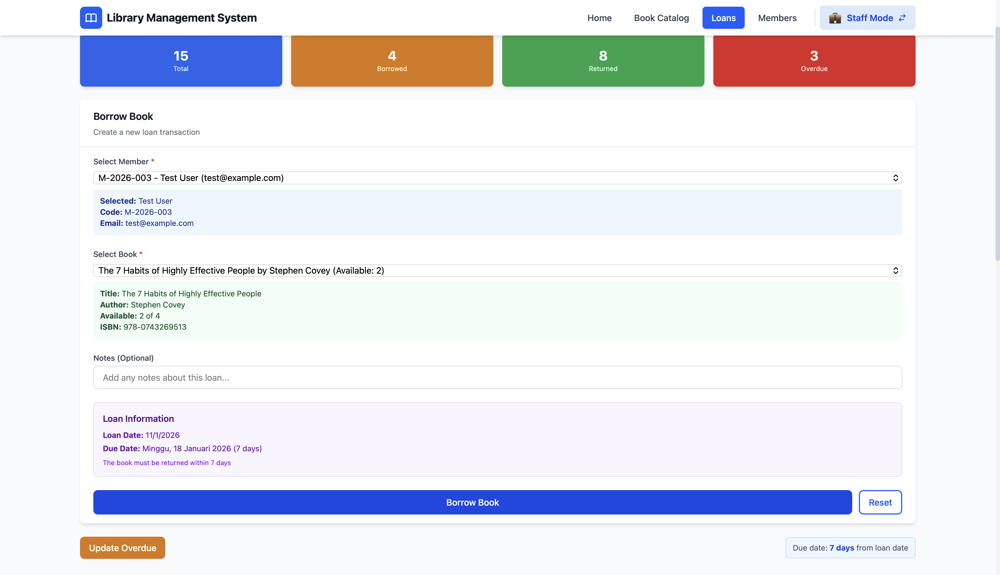
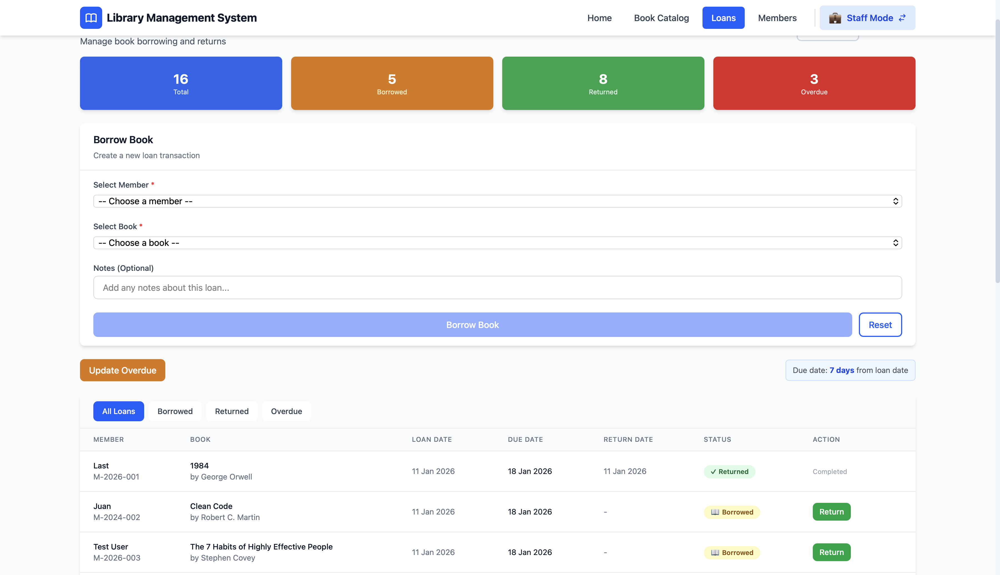

# 🧪 Testing Documentation

Manual testing report untuk Library Management System.

---

## 📊 Test Summary

| Metric | Value |
|--------|-------|
| **Total Test Cases** | 15 |
| **Passed** | 15 ✅ |
| **Failed** | 0 ❌ |
| **Success Rate** | **100%** |

---

## 🎯 Test Categories

### 1. User Interface (3 tests)
- ✅ Home page rendering
- ✅ Mode switching
- ✅ Responsive design

### 2. Book Catalog (3 tests)
- ✅ View all books
- ✅ Search functionality
- ✅ Filter by category

### 3. Loan Management (5 tests)
- ✅ Create loan
- ✅ Create loan validation
- ✅ Return book
- ✅ View loans with filters
- ✅ Update overdue status

### 4. Member Management (3 tests)
- ✅ Register member
- ✅ Search members
- ✅ View member stats

### 5. Business Logic (1 test)
- ✅ Due date calculation (7 days)

---

## 📝 Sample Test Cases

### TC-01: Home Page Rendering

**Priority:** High  
**Type:** Functional

**Preconditions:**
- Application running
- Database has sample data

**Steps:**
1. Open `http://localhost:5173`
2. Observe page elements

**Expected:**
- Home page loads in < 3 seconds
- Stats cards display (books, members, loans)
- "Browse Books" button visible
- All elements render correctly

**Result:** ✅ PASS  
**🏠 Home Dashboard**


---

### TC-02: Mode Switching

**Priority:** High  
**Type:** Functional

**Preconditions:**
- User on home page

**Steps:**
1. Check navbar (top right)
2. Note current mode ("Member Mode")
3. Click toggle button
4. Observe changes

**Expected:**
- Initial: "👤 Member Mode" (green)
- After click: "💼 Staff Mode" (blue)
- Staff menu appears (Loans, Members)
- After second click: Returns to Member

**Result:** ✅ PASS  



---

### TC-05: Create Loan (Staff)

**Priority:** Critical  
**Type:** Functional

**Preconditions:**
- Staff Mode enabled
- Member exists (M-2026-002)
- Book available (Clean Code)

**Steps:**
1. Navigate to Staff Loans
2. Fill form:
   - Member: M-2026-002 (John Doe)
   - Book: Clean Code
   - Notes: "Test loan"
3. Click "Borrow Book"

**Expected:**
- Success message appears
- New loan in table below
- Loan Date: Today
- Due Date: Today + 7 days
- Status: Borrowed (yellow badge)
- Book availability decreases

**Result:** ✅ PASS  



---

### TC-07: Return Book

**Priority:** Critical  
**Type:** Functional

**Preconditions:**
- Staff Mode
- Active loan exists

**Steps:**
1. Go to Staff Loans
2. Find borrowed loan
3. Click green "Return" button
4. Confirm if prompted

**Expected:**
- Success message
- Status → Returned (gray badge)
- Return Date: Today
- "Return" button disappears
- Book availability increases

**Result:** ✅ PASS  


---

### TC-10: Update Overdue

**Priority:** High  
**Type:** Functional

**Preconditions:**
- Staff Mode
- Loans exist with past due dates

**Steps:**
1. Go to Staff Loans
2. Click "Update Overdue" button
3. Observe changes

**Expected:**
- Message: "X loan(s) marked as overdue"
- Overdue count updates
- Red badges on overdue loans
- Overdue tab shows loans

**Result:** ✅ PASS  


---

### TC-12: Register Member

**Priority:** High  
**Type:** Functional

**Preconditions:**
- Staff Mode
- On Staff Members page

**Steps:**
1. Fill registration form:
   - Name: "Test User"
   - Email: "test@example.com"
   - Phone: "081234567890"
2. Click "Register Member"

**Expected:**
- Success message with member code
- Member code format: M-YYYY-XXX
- New member appears in list
- Form clears
- Stats update

**Result:** ✅ PASS  



---

### TC-15: Due Date Calculation

**Priority:** Critical  
**Type:** Business Logic

**Preconditions:**
- Staff Mode
- On Staff Loans page

**Steps:**
1. Note today's date: Jan 11, 2026
2. Create new loan
3. Check loan date and due date

**Expected:**
- Loan Date: 2026-01-11
- Due Date: 2026-01-18 (exactly 7 days later)
- No manual input required
- Consistent across all loans

**Result:** ✅ PASS  



---

## 📈 Coverage Summary

**Features Tested:**
```
✅ Home Page               100% (1/1)
✅ Mode Toggle             100% (1/1)
✅ Book Catalog            100% (3/3)
✅ Loan Management         100% (5/5)
✅ Member Management       100% (3/3)
✅ Business Logic          100% (1/1)
```

**Requirements:**
```
✅ Catalog for members     PASS (TC-04)
✅ Create loan (staff)     PASS (TC-05, TC-06)
✅ Return book             PASS (TC-07)
✅ Auto due date (7 days)  PASS (TC-15)
✅ Track availability      PASS (verified in TC-05, TC-07)
✅ Member registration     PASS (TC-12)
```

---

## ✅ Test Conclusion

**Summary:**

All 15 test cases **PASSED** successfully. The system meets all LSP certification requirements:

1. ✅ **100% Success Rate**
2. ✅ **All Features Working**
3. ✅ **Business Logic Correct** (7-day loan period)
4. ✅ **Data Integrity Maintained**
5. ✅ **UI/UX Responsive**

---

**All test cases passed.** 🎉
